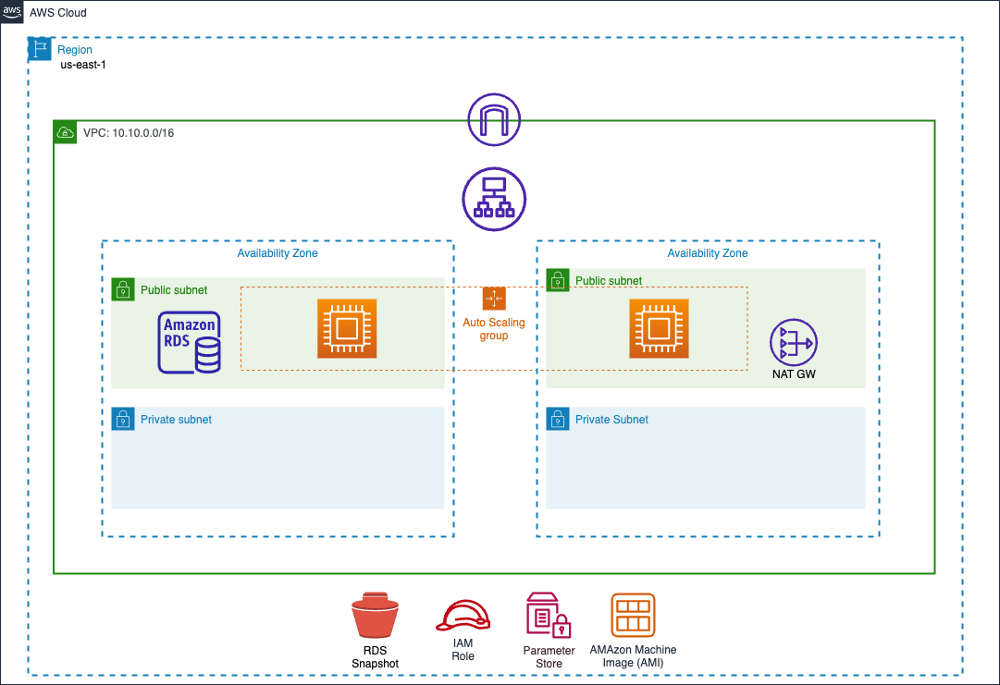

# Terraform AWS Deployment for Competition

This Terraform deployment creates resources in your AWS account for the competition. The deployment is intentionally misconfigured for the competition, but it will still work and the Flask application functionality will be available upon deployment completion.

## Prerequisites

Before you get started, make sure you have:

- Installed the AWS CLI. You can install the AWS CLI by following the instructions [here](https://aws.amazon.com/cli/).
- Configured your AWS region to be **`us-east-1` (US East N. Virginia)**.
- Installed Terraform v1.3.X or above. You can find the instructions for installing Terraform [here](https://developer.hashicorp.com/terraform/downloads?product_intent=terraform).
- Configured your AWS credentials. The temporary credentials are provided by AWS as part of your competition-specific AWS account initialization. Follow the instructions below to export these credentials as environment variables. Alternatively, you can store the credentials in the `~/.aws/credentials` file (Mac) or `C:\Users\username\.aws\credentials` file (Windows).

### How to set environment variables

- Linux or macOS

    ```
    export AWS_ACCESS_KEY_ID=##ExampleKeyID##
    export AWS_SECRET_ACCESS_KEY=##ExampleAccessKey##
    export AWS_DEFAULT_REGION=us-east-1
    export AWS_SESSION_TOKEN=##Example_SESSION_TOKEN##
    ```

- Windows Command Prompt for user current session

    ```
    C:\> set AWS_ACCESS_KEY_ID=###ExampleKeyID###
    C:\> set AWS_SECRET_ACCESS_KEY=###ExampleAccessKey##
    C:\> set AWS_DEFAULT_REGION=us-east-1
    C:\> set AWS_SESSION_TOKEN=##Example_SESSION_TOKEN##
    ```

- Windows PowerShell

    ```
    PS C:\> $Env:AWS_ACCESS_KEY_ID="###ExampleKeyID###"
    PS C:\> $Env:AWS_SECRET_ACCESS_KEY="###ExampleAccessKey##"
    PS C:\> $Env:AWS_DEFAULT_REGION="us-east-1"
    PS C:\> $Env:AWS_SESSION_TOKEN=##Example_SESSION_TOKEN##
    ```

Note: Be sure to replace the values of **these environment variables** with your own.

## Usage

To use this deployment, follow these steps:

1. Change to the Terraform directory: `cd Terraform`.
2. Initialize the Terraform deployment: `terraform init`.
3. Validate the Terraform configuration: `terraform validate`.
4. Preview the Terraform deployment: `terraform plan`.
5. Apply the Terraform deployment: `terraform apply`.

If the `terraform apply` command was successful, you should see the ALB as the output:
Apply complete! Resources: 36 added, 0 changed, 0 destroyed.

```
Outputs:

alb_dns_name = "this-lb-########.us-east-1.elb.amazonaws.com"

```

Open your browser and navigate to your ALB URL to confirm that you can load the Flask app.

## Deployed Architecture

Here's a diagram of the application hosting solution:



## Invoking Application

The Terraform deployment outputs the host URL of the application. Copy this URL and open it in your browser.
